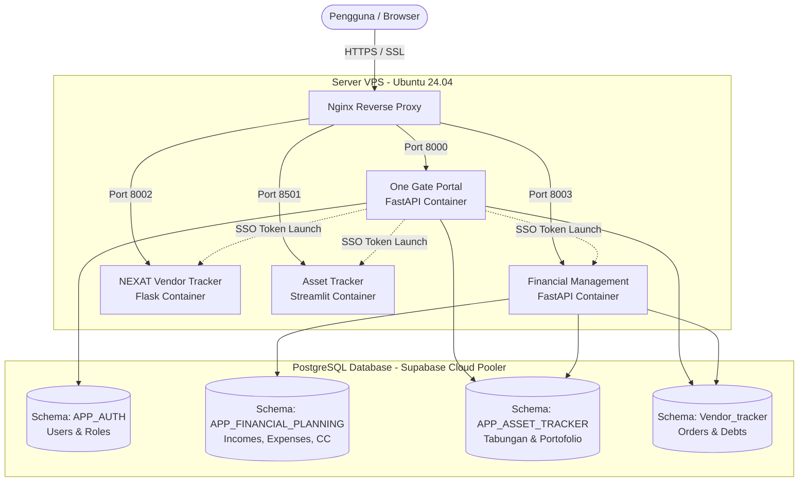

# 🚀 Project Showcase: Ecosystem Intelligence — One Gate Portal & Single Sign-On (SSO)


> **Tagline:** *Unified Microservice Gateway, Enterprise SSO Identity Provider & Executive Command Center for Business & Financial Ecosystem.*

---

## 📌 Executive Summary

**One Gate Portal** adalah platform pintu gerbang terpadu (*Unified Central Gateway*) dan penyedia identitas (*Identity Provider*) berbasis **Single Sign-On (SSO)** yang menghubungkan seluruh ekosistem aplikasi independen (NEXAT Fashion Vendor Tracker, Financial Management, Asset Tracker, dan ASPIRAN! AI Business Intelligence Assistant) ke dalam satu pintu masuk yang aman, terisolasi per-pengguna, dan *zero-downtime*.

Proyek ini dirancang untuk menjawab tantangan fragmentasi data, login berulang kali di berbagai port microservices, serta kebutuhan kontrol akses berbasis hak istimewa (*Superadmin Approval Workflow*).

---

## 💡 Problem Statement & Solusi

```
┌───────────────────────────────────────────────┐
│               TANTANGAN AWAL                  │
├───────────────────────────────────────────────┤
│ • Login terpisah di setiap subdomain/port     │
│ • Risiko kebocoran data antar pengguna        │
│ • Sulit memantau metrik bisnis & keuangan     │
│ • Proses deployment manual & rawan downtime   │
└───────────────────────┬───────────────────────┘
                        │ SOLUSI DENGAN ONE GATE PORTAL
                        ▼
┌───────────────────────────────────────────────┐
│            ONE GATE PORTAL HUB                │
├───────────────────────────────────────────────┤
│ 1. 🔑 SSO Terpusat (JWT RS256/HS256)          │
│ 2. 🛡️ Strict Zero-Data Leakage Isolation      │
│ 3. 🤖 Integrasi AI Assistant (Gemini Flash)   │
│ 4. 🚀 1-Click Zero-Downtime Deployment        │
└───────────────────────────────────────────────┘
```

---

## 🌟 Fitur & Kapabilitas Unggulan

### 1. 🔑 Centralized SSO & Seamless App Launcher
- Autentikasi terpusat berbasis **JSON Web Token (JWT)** dengan auto-propagation token ke microservices anak (`?token=<jwt>`).
- Sekali login di portal utama ([basecampmeera.cloud](https://basecampmeera.cloud)), pengguna dapat langsung membuka aplikasi ekosistem tanpa perlu login ulang.

### 2. 🛡️ Superadmin Approval & Strict Data Isolation
- **Self-Registration with Pending Approval:** Pendaftaran akun baru otomatis masuk ke antrean persetujuan (*approval queue*).
- **Executive Approval Panel:** Akses eksklusif bagi Superadmin (Aan) dengan *badge count* real-time untuk menyetujui (*approve*) atau menolak (*reject*) pendaftaran akun.
- **Per-Username Data Isolation:** Setiap data (tabungan, portofolio, hutang, catatan vendor) diisolasi berdasarkan username dengan filter `LOWER(username)` di seluruh lapisan PostgreSQL schema.

### 3. 🤖 ASPIRAN! AI Assistant & Interactive Simulator
- Simulasi dialog cerdas bot Telegram berbasis AI yang mampu merangkum status operasional konveksi NEXAT, valuasi aset portofolio, screener saham (IHSG), dan proyeksi arus kas dalam format conversational.

### 4. ⚡ 1-Click Automated VPS Deployment
- Mekanisme deployment otomatis dari komputer pengembang lokal ke VPS Ubuntu via skrip PowerShell (`deploy.ps1` / `deploy.bat`).
- Menjalankan *remote SCP synchronization*, *Docker multi-stage rebuild*, *Nginx reverse proxy reload*, dan *SSL verification* dalam waktu < 20 detik.

---

## 🏗️ Arsitektur Sistem & Alur Data



---

## 🛠️ Tech Stack & Ekosistem Teknologi

| Kategori | Teknologi | Deskripsi Penggunaan |
|---|---|---|
| **Backend & API** | Python 3.11, FastAPI, Uvicorn | High-performance async REST API & SSO Token Authority |
| **Frontend & UI** | Semantic HTML5, CSS3 Tokens, Vanilla JS (ES6+) | Modern Glassmorphism & Cybernetic Command Center UI (Non-AI Look) |
| **Security & Auth** | PyJWT, PBKDF2-HMAC-SHA256 (Salted) | Enkripsi kredensial & otentikasi stateless lintas domain |
| **Database & ORM** | PostgreSQL 15 (Supabase), SQLAlchemy 2.0 | Multi-schema architecture dengan koneksi pooler AWS |
| **Container & Ops** | Docker, Docker Compose, Nginx, Certbot SSL | Containerized microservices dengan zero-downtime restart |
| **Data Viz** | Chart.js 4.4, SVG Animated Wave & Pulse | Visualisasi metrik finansial, radar performa, dan arus kas |

---

## 📊 Highlight Database & Multi-Schema Isolation

Sistem membagi data menjadi 4 skema terisolasi di database PostgreSQL:
1. **`APP_AUTH`**: Mengelola tabel `users` (status approval, role, password hash dengan salt, token generator).
2. **`APP_FINANCIAL_PLANNING`**: Mengelola tabel `incomes`, `expenses`, `credit_cards`, `purchases`, `installments`, dan profil finansial forward-looking 12-24 bulan.
3. **`APP_ASSET_TRACKER`**: Mengelola tabel saldo rekening kas live (`tabungan`) dan portofolio pasar modal (`portofolio_saham`).
4. **`Vendor_tracker`**: Mengelola pesanan konveksi dan kewajiban jatuh tempo pembayaran vendor apparel.

---

## 📈 Key Impact & Hasil Implementasi

- ⚡ **Zero Re-Authentication:** Mengurangi waktu login harian hingga **100%** antar microservices ekosistem.
- 🔒 **Zero Data Bleed:** Pengguna hanya dapat membaca dan menulis data miliknya sendiri, diverifikasi pada level ORM query case-insensitive.
- ⏱️ **Instant Deployment:** Waktu rilis kode dari lokal ke server live dipangkas dari **~15 menit (manual)** menjadi **< 25 detik (1-Click Deploy)**.
- 📱 **Omni-device Support:** Antarmuka adaptif penuh dari layar smartphone (Mobile Dock Navigation) hingga monitor Ultra-Wide desktop.

---

## 📂 Repositori & Akses Live
- **Portal Live:** [https://basecampmeera.cloud](https://basecampmeera.cloud)
- **Financial Sub-Engine Live:** [https://finance.basecampmeera.cloud](https://finance.basecampmeera.cloud)
- **GitHub Repository (Practice Program):** `https://github.com/Makrufkasr/Practice-Program.git`
- **GitHub Repository (Financial Management):** `https://github.com/Makrufkasr/financial_management.git`
