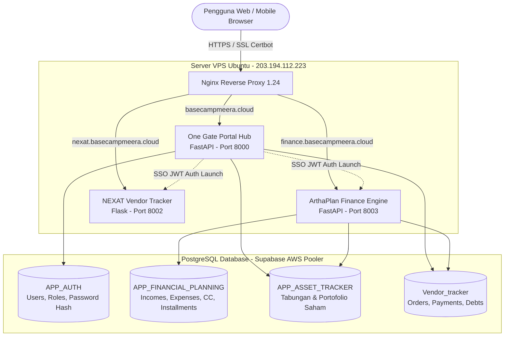

# 🚀 Project Showcase: Ecosystem Intelligence & Multi-App Microservices

> **Ecosystem Title:** *Ecosystem Intelligence — One Gate Portal, Single Sign-On (SSO) & Business Command Center*  
> **Author & Superadmin:** **Aan**  
> **Production Live URL:** [https://basecampmeera.cloud](https://basecampmeera.cloud) | [https://finance.basecampmeera.cloud](https://finance.basecampmeera.cloud)

---

## 📌 1. One Gate Portal & Enterprise SSO Hub

Pintu gerbang terpusat (*Central Gateway*) dengan antarmuka futuristik cybernetic yang menghubungkan seluruh aplikasi bisnis, asisten AI, dan modul finansial.

### 🌟 Fitur Unggulan Portal:
- **Centralized SSO (JWT):** Otentikasi sekali masuk dengan auto-propagation token ke subdomain microservices (`?token=<jwt>`).
- **Superadmin Role (Aan):** Dilengkapi badge status Superadmin dan antrean persetujuan registrasi akun pengguna baru (*Pending Approval Workflow*).
- **Strict Data Isolation:** Isolasi data per-pengguna secara ketat (*Zero Data Leakage*) di seluruh lapisan skema database PostgreSQL.

---

## 📊 2. ArthaPlan — 12-Month Cashflow Projection & Financial Management

Engine perencanaan finansial forward-looking dengan visualisasi bar-chart & line-chart terintegrasi untuk memproyeksikan saldo kas kumulatif, biaya rutin, cicilan, dan kewajiban pengeluaran mendatang.

### 🌟 Fitur Utama Finansial:
- **Forward-Looking Cashflow (12-24 Bulan):** Simulasi penerimaan vs pengeluaran (biaya tetap, cicilan, dan hutang mendatang) secara granular per bulan.
- **Rincian Bulanan Carousel:** Menampilkan kartu pergerakan kas bulanan (Bulan 1 s/d Bulan 12) dengan rincian accordion interaktif (Surplus/Defisit).
- **Dark Mode & Light Mode:** Dukungan penuh pergantian tema dengan CSS custom properties responsif.

---

## 📦 3. Rekap Kekurangan Bayar Vendor (Supply Chain Payables)

Modul tracking kewajiban pelunasan termin vendor konveksi pakaian (*NEXAT Apparel*) yang terhubung langsung secara real-time ke skema database `Vendor_tracker`.

### 🌟 Highlight Kemampuan:
- **Live Integration:** Membaca status order produksi, total biaya, pembayaran termin yang sudah masuk, dan sisa kekurangan bayar.
- **Auto-Injection ke Arus Kas:** Kekurangan bayar vendor secara otomatis masuk ke daftar *Planned Expenses* pada modul proyeksi bulanan sesuai tanggal jatuh tempo.

---

## 💳 4. Pemantauan Kartu Kredit & Pembelian Cicilan

Manajemen limit kredit, rasio utilisasi perbankan, dan penjadwalan amortisasi cicilan barang dengan informasi tenor dan step cicilan transparan.

### 🌟 Highlight Kemampuan:
- **Credit Card Health:** Monitoring limit kartu kredit dan rasio pemakaian limit (*utilization rate*).
- **Installment Amortization:** Menghitung alokasi potongan per bulan dan rincian tenor (contoh: *Kasur - Bulan ke-1 dari 12*).

---

## 📈 5. Portofolio Aset Pasar Modal & Rekening Kas Live

Monitoring aset likuid (rekening bank) dan valuasi portofolio investasi pasar modal (saham IHSG & emas) terintegrasi skema `APP_ASSET_TRACKER`.

### 🌟 Highlight Kemampuan:
- **Live Net Worth Calculation:** Menghitung total nilai pasar, modal awal, serta *floating profit/loss* secara instan.
- **Multi-Asset Allocation:** Rekapitulasi saham (BBCA, BBRI) dan komoditas fisik emas dalam satu ringkasan portofolio.

---

## 🏗️ Arsitektur Sistem & Ekosistem Teknologi

---

## 🛠️ Ringkasan Tech Stack

| Kategori | Teknologi |
|---|---|
| **Backend & Microservices** | Python 3.11, FastAPI, Uvicorn, SQLAlchemy 2.0, PyJWT |
| **Frontend & Visualization** | Semantic HTML5, Modern CSS3 Tokens, Vanilla JavaScript (ES6+), Chart.js 4.4 |
| **Database Architecture** | PostgreSQL 15 (Supabase Cloud Pooler), Multi-Schema Isolation |
| **DevOps & Deployment** | Docker Multi-Stage, Docker Compose, Nginx, Certbot SSL, 1-Click Deployment Script (`deploy.ps1`) |
| **Security & Cryptography** | PBKDF2-HMAC-SHA256 (Salted), Stateless JWT Cross-Subdomain Auth |

---

## 📈 Nilai Tambah & Business Impact
1. ⚡ **Single Sign-On (SSO):** Mengurangi friksi operasional dengan eliminasi login berulang.
2. 🔒 **Keamanan & Privasi:** Zero data leakage per-username dengan isolasi database yang teruji.
3. ⏱️ **DevOps Efisien:** 1-Click Deployment otomatis mempercepat proses rilis kode ke server dalam hitungan detik.
4. 💼 **Visibilitas Finansial & Operasional:** Integrasi live antara hutang vendor konveksi dan proyeksi arus kas pribadi.
